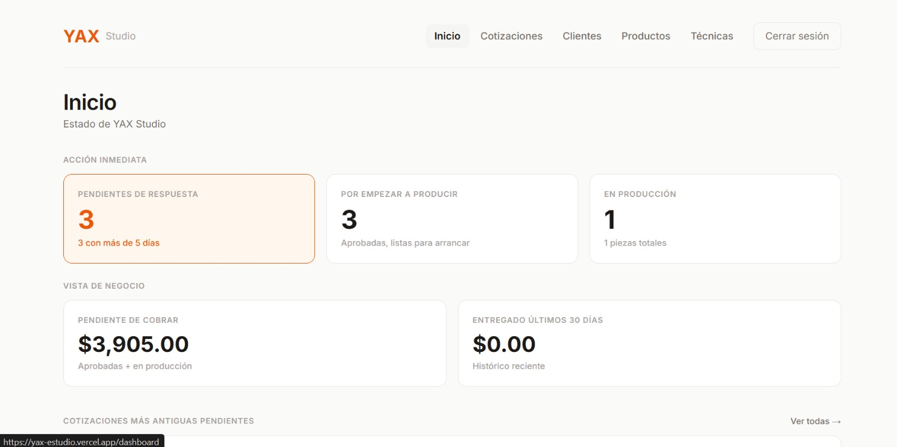
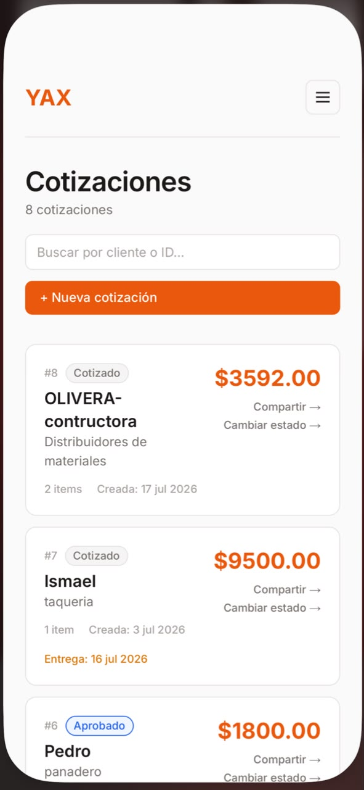
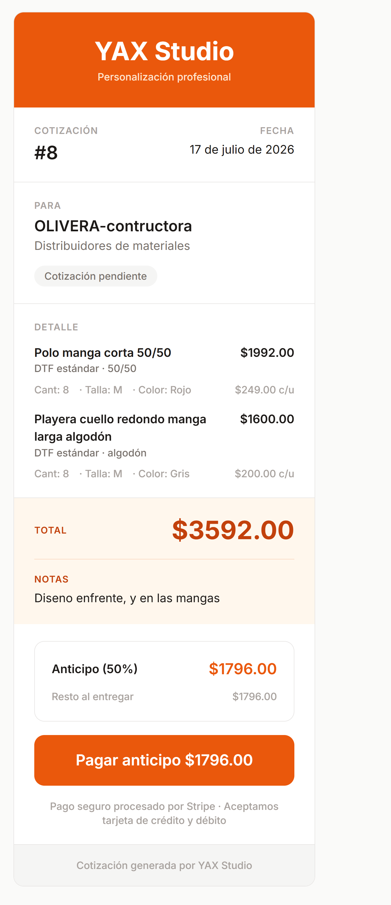

# YAX Studio

[](https://yax-estudio.vercel.app)
[](https://nextjs.org)
[](https://x.com/DanielJuarez8J)

> Sistema interno de gestión de cotizaciones, clientes y producción para un negocio B2B de personalización textil.

**🔗 Demo en producción:** https://yax-estudio.vercel.app



---

## El problema

Antes de este sistema, hacía las cotizaciones en Excel y las mandaba por WhatsApp. El riesgo de perder el chat era alto y el orden que llevaba era completamente manual. Cada cotización repetida me tomaba más de 10 minutos para recalcular precios y me encontraba con la incertidumbre de depender del scroll de WhatsApp. Necesitaba orden, dejar esta forma anticuada y encontrar una manera más rápida, registrar la descripción del producto sin fricción y mantener un historial que sobreviviera al chat de WhatsApp.

---

## Lo que hace

- **CRUD completo** de clientes, productos y técnicas con soft delete e imágenes.
- **Cotizaciones dinámicas** con cálculo automático de precios (individual vs. mayoreo desde 6+ piezas).
- **Link público por cotización** que el cliente puede aceptar con un toque, sin necesidad de cuenta.
- **Dashboard con métricas accionables**: pendientes de respuesta, urgentes (>5 días sin contestar), aprobadas sin producir y dinero por cobrar.
- **Compartir por WhatsApp** con mensaje prearmado y link directo.

---

## Stack técnico

Para resolverlo construí el sistema con las siguientes decisiones técnicas:

- **Next.js 16** — Elegí App Router y Server Actions para mantener la lógica de negocio cerca de la interfaz, evitando crear una capa adicional de API REST para operaciones internas como crear cotizaciones, actualizar estados o gestionar catálogos.
- **TypeScript (strict mode)** — Al manejar cálculos de precios, estados de cotizaciones y relaciones entre entidades, preferí detectar errores durante el desarrollo en lugar de encontrarlos cuando el sistema ya estuviera en producción.
- **Tailwind CSS 4** — Me permitió construir la interfaz rápidamente sin mantener una colección de hojas de estilo separadas. En un proyecto desarrollado en 30 días, prioricé velocidad de iteración sobre una arquitectura CSS más compleja.
- **Supabase (PostgreSQL + Auth + Storage)** — Necesitaba autenticación, base de datos relacional y almacenamiento de imágenes sin administrar infraestructura. PostgreSQL también facilitó mover parte de la lógica crítica, como la creación transaccional de cotizaciones, al propio motor de base de datos.
- **Vercel** — La integración con GitHub y el soporte nativo para Next.js hicieron que el despliegue fuera prácticamente automático. No evalué otras alternativas porque, para el tamaño actual del proyecto, cubría completamente mis necesidades.
- **Git + Conventional Commits** — Mantener un historial consistente facilita entender la evolución del proyecto y localizar cambios específicos conforme el sistema sigue creciendo.

---

## Decisiones de arquitectura

### Case study — Refactor del componente `<Modal>`

Antes del refactor, tenía cinco implementaciones distintas de modales (`cliente-form`, `producto-form`, `tecnica-form`, `eliminar-cliente-button` y `cambiar-estado-button`). Aunque cumplían la misma función, cada uno duplicaba la estructura del overlay, el contenedor principal y el encabezado, por lo que cualquier cambio visual debía repetirse en varios archivos.

Decidí extraer toda esa lógica a un único componente compartido (`src/components/modal.tsx`) con una API pequeña y controlada (`isOpen`, `onClose`, `children` y `title`). Consideré mantener variantes independientes para conservar pequeñas diferencias entre modales, pero preferí sacrificar esa flexibilidad inicial a cambio de una interfaz consistente y un único punto de mantenimiento. Como parte del refactor añadí el cierre al hacer clic sobre el backdrop; a cambio, acepté perder el botón ✕ que existía en `cambiar-estado-button`, priorizando la consistencia entre todos los modales.

El resultado fue reemplazar cinco implementaciones duplicadas por un solo componente reutilizable, reduciendo el código duplicado en cada archivo y haciendo que futuras mejoras se implementen en un único lugar.

### Case study — Refactor del componente `<Buscador>`

Al implementar el buscador para clientes y cotizaciones terminé con dos componentes casi idénticos (`clientes/buscador.tsx` y `cotizaciones/buscador.tsx`). La única diferencia real era la ruta utilizada en `router.push`, mientras que el debounce, los estilos y el resto del comportamiento estaban completamente duplicados.

Decidí extraer la lógica a un componente compartido (`src/components/buscador.tsx`). Consideré recibir la ruta como una prop, pero eso obligaba a cada página a conocer detalles de implementación que el componente podía resolver por sí mismo. En su lugar utilicé `usePathname()` para detectar automáticamente la ruta actual y reutilizar el mismo componente sin configuración adicional. La única prop que mantuve fue `placeholder`, para permitir textos distintos según el contexto, además de hacer el ancho responsive (`w-full sm:w-64`).

Este enfoque introduce un **trade-off**: el componente "adivina" la ruta en la que se encuentra, lo que puede parecer menos explícito que recibirla como prop. También dejé pendiente optimizar las dependencias del `useEffect` (`valor`, `pathname`, `router` y `searchParams`), ya que en escenarios poco comunes podrían provocar navegaciones redundantes. Consideré ese caso como **YAGNI**, porque no representaba un problema real para el uso actual del sistema.

El resultado fue reemplazar dos implementaciones duplicadas por un único componente reutilizable, que ahora puede utilizarse en cualquier página que filtre mediante el parámetro `?q=` sin volver a escribir la lógica de búsqueda.

El screenshot inferior muestra la vista mobile de cotizaciones, donde los componentes compartidos también aplican.



### Otras decisiones técnicas

- **Server Actions** en lugar de API Routes para mutaciones, manteniendo type safety end-to-end.
- **Función PostgreSQL transaccional** (`crear_cotizacion_con_items`) para guardar cotización e ítems como una operación atómica.
- **Route Group (`(interna)`)** para separar rutas autenticadas de la cotización pública sin duplicar middleware.
- **Validación en cliente y servidor** en todos los formularios (*defense in depth*).
- **Soft delete con `activo: boolean`** para preservar la integridad histórica de cotizaciones anteriores.
- **Slug MD5 aleatorio de 10 caracteres** para las URLs públicas, evitando exponer IDs internos.

### Schema de base de datos

```text
clientes ─┬─< cotizaciones ─< items_cotizacion >─ productos
                                              └─ tecnicas_impresion
```

Las 7 migraciones viven en `/db/`, por lo que toda la historia del esquema puede reproducirse desde cero.

---

## Vista del cliente (cotización pública)

Una vez creada la cotización desde el panel interno, el sistema genera un enlace público que puedo compartir por WhatsApp. El cliente puede consultar la información, revisar precios, aceptar la cotización y, opcionalmente, realizar el anticipo sin necesidad de crear una cuenta.



---

## Correr localmente

```bash
git clone https://github.com/DaniielA5/yax-estudio.git
cd yax-estudio
npm install

# Crea .env.local con tus credenciales de Supabase:
# NEXT_PUBLIC_SUPABASE_URL=https://tu-proyecto.supabase.co
# NEXT_PUBLIC_SUPABASE_ANON_KEY=tu-anon-key

npm run dev
```

---

## Deuda técnica conocida

- **Migración de `middleware` a `proxy` en Next.js 16**: la convención `middleware` está deprecada en Next.js 16, aunque sigue funcionando y genera un warning en cada build. Pospuse la migración porque no aporta valor inmediato al negocio.
- **Instancias separadas para desarrollo y producción**: actualmente desarrollo y producción comparten la misma instancia de Supabase. Es una decisión aceptable para un proyecto personal, pero antes de escalar conviene aislar ambos entornos para reducir riesgos sobre los datos.
- **Recuperación de errores en Stripe**: si Stripe crea una sesión de pago y Supabase falla al guardar el `session_id`, actualmente solo registro el error. Falta implementar un mecanismo de compensación o rollback para evitar estados inconsistentes.
- **Dropdown de "Compartir"**: es posible abrir varios menús de compartir al mismo tiempo. El impacto es únicamente visual y de experiencia de usuario, por lo que decidí priorizar funcionalidades con mayor valor para el negocio.
- **Vulnerabilidades transitivas de npm**: el proyecto reporta dos vulnerabilidades heredadas de dependencias de `Next.js` y `PostCSS`. La corrección automática mediante `npm audit fix --force` implica un downgrade mayor de Next.js, por lo que decidí esperar una actualización oficial del ecosistema en lugar de introducir un cambio potencialmente disruptivo.

---

## Roadmap

- [x] CRUD completo de clientes, productos y técnicas.
- [x] Cotizaciones con cálculo dinámico.
- [x] Link público y aceptación por parte del cliente.
- [x] Dashboard con métricas.
- [x] Deploy a producción.
- [x] Integración con Stripe para anticipos.
- [ ] Tipos auto-generados de Supabase.
- [ ] Notificaciones por correo electrónico.
- [ ] Multi-tenancy para otros talleres de impresión.

---

Construido por **Daniel J** — estudiante de Ingeniería en Sistemas Computacionales, en formación como freelance frontend → backend developer.

Build-in-public documentado en [X / Twitter](https://x.com/DanielJuarez8J).